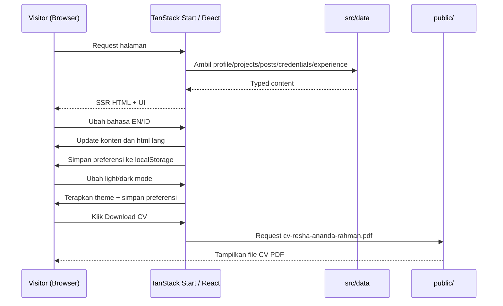
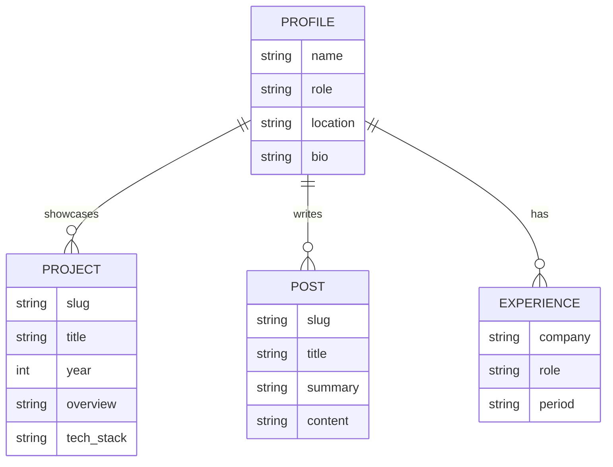

# PRD — Project Requirements Document

## 1. Overview

**Project:** Portfolio Website — Resha Ananda Rahman  
**Version:** v2.1
**Tanggal:** 21 Agustus 2026
**Status:** **Frontend implementation**
**Stack:** TanStack Start + React 19 + Tailwind CSS v4

Website portfolio ini menyediakan kehadiran daring terpadu untuk menampilkan profil, proyek, sertifikasi, riwayat karier, galeri, dan jalur kontak dalam satu tempat. Struktur konten dipusatkan pada halaman yang paling relevan bagi recruiter dan calon klien, dengan pengalaman baca yang cepat, rapi, dan mudah dipindai.

Tujuan utama website adalah menghadirkan portfolio yang cepat, rapi, profesional, mudah dirawat, mendukung SSR, tersedia dalam Bahasa Indonesia dan English, serta memungkinkan konten diperbarui melalui file di `src/data/` tanpa mengubah kode komponen.

Target pengguna utama:

- **Klien / Calon Pemberi Kerja:** melihat hasil kerja, CV, profesionalisme, dan jalur kontak.
- **Rekan Developer:** membaca tulisan teknis, melihat tech stack, dan terhubung melalui GitHub/LinkedIn.
- **HR / Perekrut:** meninjau profil dan mengunduh CV dalam format PDF.
- **Pengunjung Umum:** menjelajah galeri dan mengenal pemilik portfolio melalui halaman About.

## 2. Requirements

Berikut adalah persyaratan tingkat tinggi untuk website portfolio:

- **Performance:** Lighthouse Performance ≥ 90 dan FCP < 1,5 detik pada emulasi 4G, dengan SSR dan bundle yang tetap kecil.
- **Accessibility:** Seluruh teks memenuhi kontras WCAG AA (≥ 4.5:1), mendukung navigasi keyboard, dan menggunakan `aria-current` pada navigasi aktif.
- **Bilingual:** Seluruh UI dan konten utama tersedia dalam English dan Bahasa Indonesia melalui toggle **EN/ID**.
- **Theme:** Mendukung light/dark mode dengan preferensi tersimpan dan tanpa flash tema (FOUC).
- **Maintainability:** Konten profil, proyek, tulisan, sertifikasi, dan pengalaman dikelola secara terpusat dan typed melalui `src/data/` sebagai single source of truth.
- **Reliability:** Tidak terdapat error konsol maupun tautan internal yang menghasilkan 404 secara tidak disengaja.
- **Portability:** Menggunakan npm dengan `package-lock.json` dan tidak mempertahankan dependensi `ui/*` shadcn yang tidak digunakan.
- **Privacy:** Tidak menggunakan backend untuk menyimpan data pengguna; link sosial menggunakan `rel="noreferrer"`.
- **Navigation:** Navbar utama berisi **About, Projects, Certifications, Contact** tanpa menu Home. Route Blog dan Gallery tetap tersedia sebagai route langsung.
- **Content Delivery:** CV tersedia sebagai file PDF statis di `public/cv-resha-ananda-rahman.pdf`.

## 3. Core Features

Fitur-fitur utama website portfolio adalah sebagai berikut:

1. **Home / Landing Page**
   - Hero menampilkan satu foto profil, headline ringkas, bio singkat, CTA, dan ikon sosial.
   - Section **Core Capabilities** menampilkan kelompok Web Development, IT & Networking, serta Data & Tools.
   - Section **Selected Projects** menampilkan tiga proyek unggulan dengan badge tech stack dan tahun.
   - Work Experience ringkas dalam bentuk timeline dengan tombol **Download CV** terpisah.
   - Section kontak full-width menjelang footer.

2. **Navigation**
   - Menu utama: **About, Projects, Certifications, Contact**.
   - Halaman aktif menggunakan `aria-current="page"` dan aksen teal.
   - Theme toggle dan language toggle berada di sisi kanan navbar.
   - Pada halaman selain Home, avatar dan nama tampil di kiri dan dapat diklik untuk kembali ke `/`.

3. **Bilingual EN/ID**
   - Toggle **EN/ID** mengganti teks navigasi, hero, blog, proyek, galeri, dan kontak.
   - Bahasa aktif disimpan di `localStorage`.
   - Atribut `lang` pada `<html>` mengikuti bahasa aktif.
   - Bahasa default adalah English.

4. **About**
   - Intro berisi nama, headline, bio, portrait, CTA CV, dan tautan sertifikasi.
   - Section **Career** menampilkan riwayat kerja dalam Card timeline.
   - Section **Education** menggunakan Card dengan visual yang konsisten dengan Career.
   - Section **Tools & Skills** menampilkan skill yang dikelola dari `src/data/profile.ts`.

5. **Projects**
   - `/projects` menampilkan daftar proyek.
   - `/projects/$slug` menampilkan overview, tech stack, features, challenges & solutions, dan outcome.

6. **Blog**
   - `/blog` menampilkan daftar tulisan.
   - `/blog/$slug` menampilkan isi tulisan lengkap.
   - Judul, ringkasan, dan isi tersedia dalam EN dan ID.
   - Slug yang tidak dikenal diarahkan ke halaman 404 tanpa menyebabkan crash.

7. **Gallery**
   - `/gallery` menampilkan grid foto.

8. **Certifications**
   - `/certifications` menampilkan sertifikasi dalam card.
   - Klik card membuka modal detail menggunakan komponen Dialog shadcn.
   - Modal responsif menampilkan gambar sertifikat dan metadata terstruktur.

9. **Download CV**
   - Tombol **Download CV** membuka `/cv-resha-ananda-rahman.pdf`.
   - File PDF berada di `public/` dan harus berhasil disertakan dalam build.

10. **Light/Dark Mode**
   - Theme toggle menyimpan preferensi ke `localStorage`.
   - Jika belum ada preferensi, sistem menggunakan `prefers-color-scheme`.
   - Class `.dark` diterapkan melalui inline script untuk mencegah FOUC.

11. **Contact**
    - Form kontak menggunakan `mailto:` tanpa backend dan tanpa penyimpanan data pengguna.

12. **Error Handling**
    - 404 dan error UI ditangani melalui `__root.tsx`.
    - Pesan error tersedia dalam kedua bahasa.

## 4. User Flow

Alur utama pengunjung saat menggunakan website:

1. **Masuk ke Home:** Pengunjung membuka `/` dan melihat profil, headline, karya unggulan, kemampuan utama, pengalaman kerja, serta jalur kontak.
2. **Menilai Portfolio:** Pengunjung membuka **Project** untuk melihat daftar karya dan memilih proyek tertentu untuk membaca detail implementasinya.
3. **Mengenal Profil:** Pengunjung membuka **About** untuk melihat intro, Career, Education, skill, dan tools.
4. **Meninjau Sertifikasi:** Pengunjung membuka **Certifications** dan memilih card untuk melihat detail sertifikat.
5. **Membaca Tulisan:** Pengunjung membuka **Blog**, memilih tulisan, kemudian membaca konten melalui URL berbasis slug.
6. **Menjelajah Gallery:** Pengunjung membuka **Gallery** untuk melihat koleksi foto.
7. **Mengubah Bahasa:** Pengunjung menggunakan toggle **EN/ID**; pilihan tersimpan dan tetap aktif setelah reload atau perpindahan halaman.
8. **Mengubah Tema:** Pengunjung memilih light/dark mode; preferensi tersimpan dan diterapkan tanpa FOUC.
9. **Mengunduh CV:** HR atau perekrut menekan **Download CV** untuk membuka file PDF statis.
10. **Menghubungi:** Pengunjung menggunakan form kontak yang membuka aplikasi email melalui `mailto:`.

Rute utama yang termasuk dalam scope:

- `/`
- `/about`
- `/blog`
- `/blog/$slug`
- `/projects`
- `/projects/$slug`
- `/gallery`
- `/certifications`
- `/contact`
- `/experience` sebagai redirect kompatibilitas ke `/about#career`

## 5. Architecture

Website menggunakan arsitektur frontend berbasis **TanStack Start + React 19 + Tailwind CSS v4** dengan SSR. Konten utama tidak bergantung pada database atau CMS, melainkan disimpan secara terpusat di `src/data/` dan dikonsumsi oleh route serta komponen React.

Struktur data dan tanggung jawab utama:

- `src/data/`: single source of truth untuk profile, projects, posts, credentials, dan experience.
- Route TanStack Start: menangani Home, About, Blog, Project, Gallery, Certifications, Contact, detail berbasis slug, 404, dan error UI.
- `src/components/sections/`: komponen fitur yang dikelompokkan berdasarkan halaman atau domain.
- `src/components/ui/`: primitive shadcn dan kontrol reusable seperti toggle bahasa dan tema.
- React components: menangani presentasi UI dan interaksi pengguna.
- `localStorage`: menyimpan preferensi bahasa dan tema pada browser pengguna.
- `public/`: menyimpan aset statis termasuk CV PDF.

## 6. Database Schema

Website portfolio ini **tidak menggunakan database** dalam scope saat ini. Konten dikelola melalui typed data files di `src/data/`, sedangkan preferensi bahasa dan tema hanya disimpan secara lokal pada browser melalui `localStorage`.

Struktur data logis yang digunakan aplikasi:

| Data             | Deskripsi                                                                                             |
| ---------------- | ----------------------------------------------------------------------------------------------------- |
| **profile**      | Informasi identitas portfolio, headline, bio, lokasi, skill, dan sosial                               |
| **projects**     | Daftar proyek beserta slug, tahun, tech stack, overview, features, challenges, solutions, dan outcome |
| **posts**        | Konten blog bilingual beserta slug, judul, ringkasan, dan isi                                         |
| **experience**   | Riwayat pekerjaan/peran beserta perusahaan dan periode                                                |
| **localStorage** | Preferensi lokal pengguna untuk bahasa dan tema; bukan penyimpanan data aplikasi/server               |

## 7. Design & Technical Constraints

Bagian ini menetapkan batasan teknis, desain, scope, dan kualitas implementasi website.

1. **High-Level Technology**
   - Framework utama: **TanStack Start**.
   - UI: **React 19** dengan komponen shadcn yang source code-nya dimiliki project.
   - Styling: **Tailwind CSS v4**.
   - Rendering mengutamakan SSR untuk performa dan initial page load.
   - Package manager menggunakan npm dengan `package-lock.json`.

2. **Visual Design**
   - Estetika utama menggunakan gaya **Spotlight**.
   - Palet menggunakan zinc neutrals dengan aksen teal.
   - Font utama menggunakan Geist.
   - Seluruh halaman mendukung light dan dark mode.
   - Layout harus responsif dan tetap mudah digunakan pada ukuran layar berbeda.

3. **Accessibility**
   - Kontras teks minimal mengikuti WCAG AA (≥ 4.5:1).
   - Navigasi dapat digunakan melalui keyboard.
   - Link navigasi aktif menggunakan `aria-current="page"`.
   - Atribut `<html lang>` mengikuti bahasa aktif.

4. **Performance & Reliability**
   - Lighthouse Performance ≥ 90.
   - FCP < 1,5 detik pada emulasi 4G.
   - Tidak ada error konsol.
   - Tidak ada broken internal link atau 404 yang tidak disengaja.
   - Bundle dijaga tetap kecil dan dependensi yang tidak digunakan harus dihapus.

5. **Content & Maintainability**
   - Konten dikelola melalui `src/data/` dan tidak di-hardcode tersebar di komponen.
   - Data harus typed dan menjadi single source of truth.
   - Dokumen PRD, DESIGN, dan README harus tetap sinkron dengan implementasi.

6. **In Scope**
   - Rute aktif: `/`, `/about`, `/blog`, `/blog/$slug`, `/projects`, `/projects/$slug`, `/gallery`, `/certifications`, `/contact`.
   - `/experience` dipertahankan sebagai redirect ke section Career di About.
   - Hero, Core Capabilities, Selected Projects, Work Experience, dan Contact pada Home.
   - Bilingual EN/ID.
   - Light/dark theme tanpa FOUC.
   - Konten terpusat di `src/data/`.
   - CV PDF statis di `public/`.

7. **Out of Scope**
   - Backend/API untuk form kontak; form tetap menggunakan `mailto:`.
   - Headless CMS atau MDX.
   - Login/autentikasi.
   - Payment.
   - Komentar blog.
   - Halaman **Articles** terpisah; tulisan dikelola melalui Blog.
   - LiveClock/jam real-time di footer demi menjaga fokus performa.
